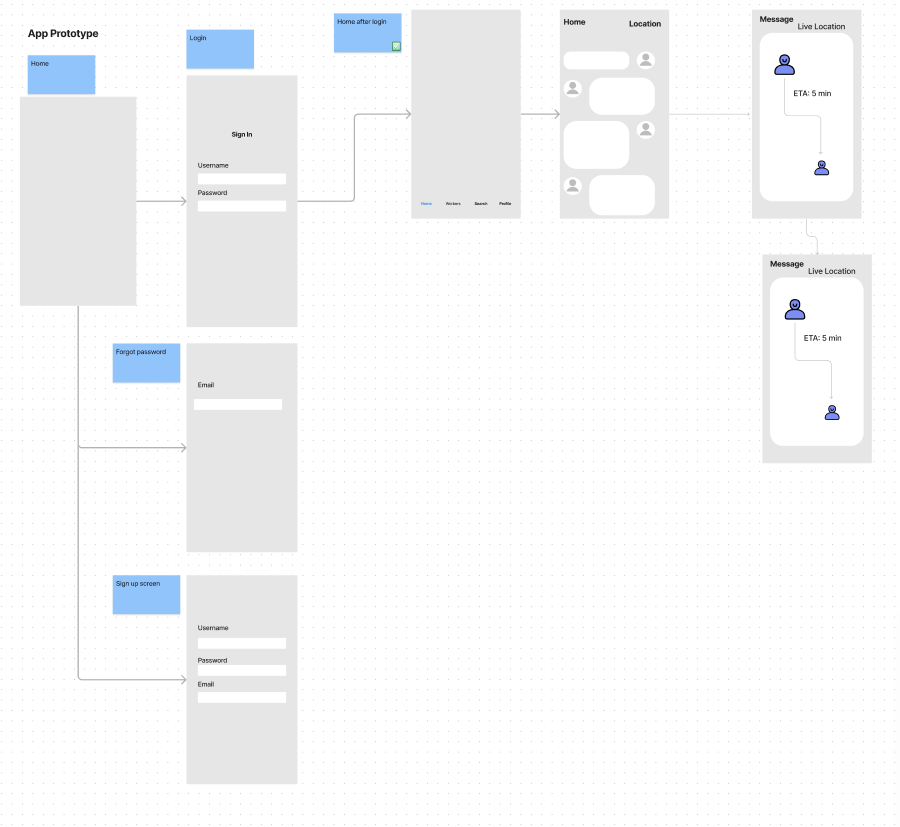
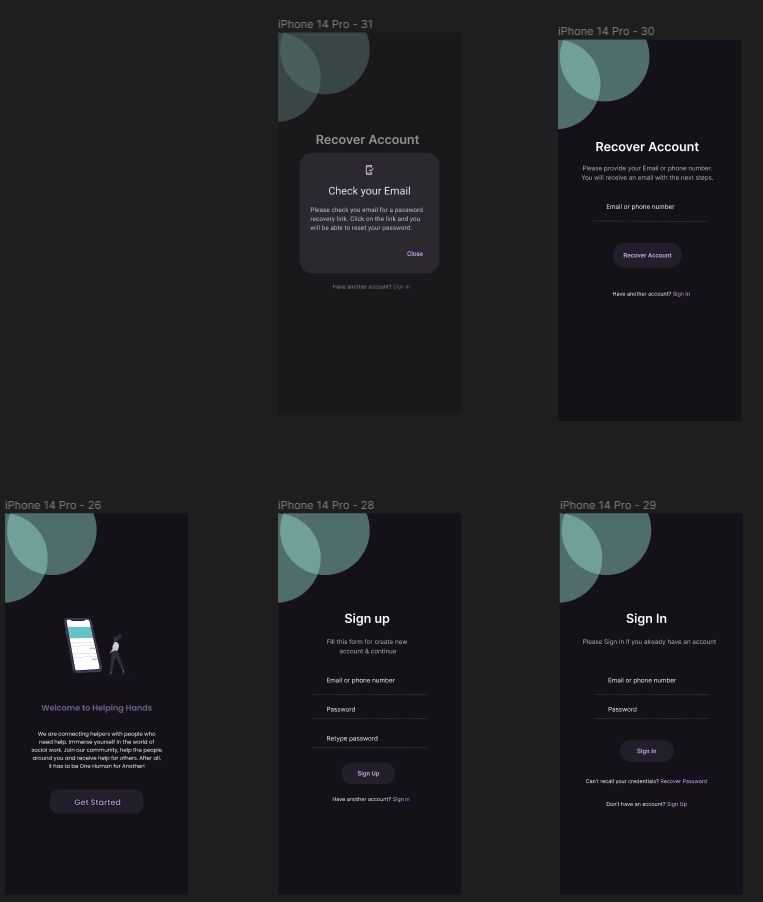
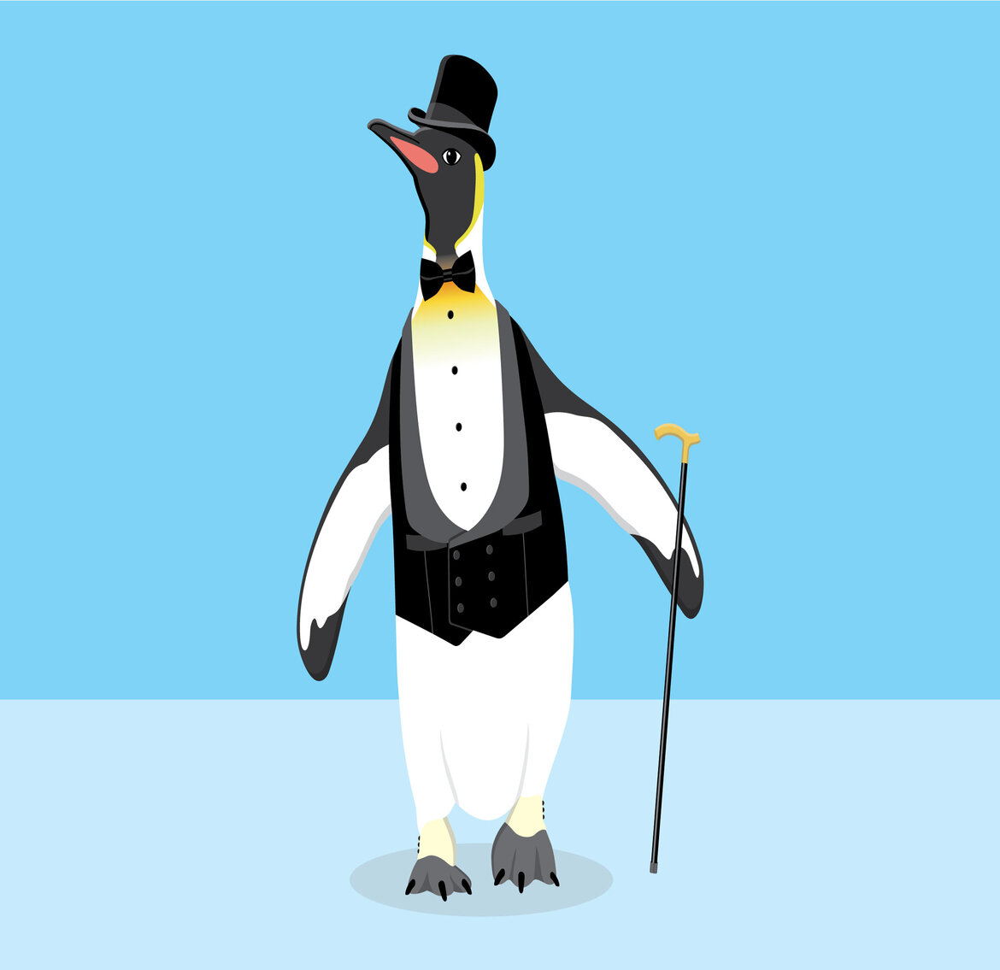

**[Helping Hands](https://www.figma.com/proto/8sfH7PEiBbzyILFKZRHFqd/Helping-Hands-Prototype?type=design&node-id=179-3647&scaling=scale-down&page-id=0%3A1&starting-point-node-id=179%3A3647)** is connecting helpers with people who need help. Immerse yourself in the world of social work. Join our community, help the people around you and receive help for others. After all, it has to be One Human for Another! 

## What is Helping Hands and Why is it Important to Us? (Task 1 P1)
---------------------------------------------------------------------------------------

We have people in our society who need support and care from others. There are also people who want to help these kinds of people. The problem is, there is no effective platform that connects these two groups. We intend to provide such a platform. The problem from our perspective is a problem because there will always be things a single person could not hope to accomplish on their own, and we want to create more opportunities for people to reach out to one another within the community in times of need. People are often forced to exhaust their funds and time in order to solve the problem of finding quality and caring helpers in today's current social and economic climate.

The design of a mutual aid app is important because it can greatly benefit communities in need. The app can help people work together, share resources, and gather information about the community's needs. This can make it easier for people to get help with things like food and healthcare. A good mutual aid app can simplify things by being a one stop shop for all aid efforts. By doing this, it can make it easier for people to access the help they need and reduce any obstacles that may be preventing them from getting it.

## User Research Data and Analysis (Task 2 P2)
---------------------------------------------------------------------------------------
To ensure that we don't build a product based on assumptions. We did extensive research and analysis.

### Users Involved in the research
- People who suffer from some kind of disability and need help from others
- Normal people who just need some help with a task
- People who help others in their surrounding
- Non-profit organizations already doing this with a different model
- Non-profit organizations which help people directly

### Research Methods Used
- Fly on the wall
- Interviews
- Story Telling

### Process

### Storyboarding
The data we collected from the research process was really extensive. To be able to extract useful actionable information, we did Storyboarding.

    
    
    
      

    

### Major Findings
- There is a need to support paid jobs. Apparently, people initially show interest but lose their enthusiasm along the way and need some motivation to continue. For this, we can allow people to create paid jobs and the ability to pay via our platform.
- There must be a way to ensure that there is a compatibility between helper and help-seeker. Helpers need specific qualities to deal with certain help-seekers. This would probably be the most challenging part. We can create an AI model for this, initially it might be difficult to infer the personality traits but with time it can be done.
- Empathy is needed both ways, from helper towards help-seeker but also vice versa. We can create separate focus groups for helpers and help-seekers and use that to generate awareness and empathy.
- If a helper is planning to work with a help-seeker that has some medical condition, the helper must be given awareness about that medical problem and how to deal with the possible implications. We can create separate focus groups for helpers and help-seekers and use that to generate awareness and empathy.
- There is a need to keep the volunteers motivated. One way to do it would be to build a community online and have in-person meetups.
- Trust is a really important aspect. To improve trust between helpers and help-seekers, we should do a background check on the helpers when they join the platform.

## Iterations From Wireframes to Prototypes (Task 3 P3)
---------------------------------------------------------------------------------------

On the left we have a snippet of our initial wire frame design and on the right we have our prototype design. We started out with a very basic wireframe design because we did not yet conduct extensive research and development into our design process yet. Being able to move to the design we currently have in our prototype required research and usability testing to help narrow down what we're trying to achieve in our application. We sent out usability testing surveys to gain insight and data on what our users might want to see in our application. After recieving this data we acted upon it, where we listen to the survey responses explaining the need for basic interface options such as a back button, having a more aesthetically pleasing homepage and helping our users understand what information is being provided on their specific page that they're on.

An example of itterations we have made for our app can be seen in our RSVP section, showing the wireframing before and the final product prototyping afterwards. We recieved feedback during our usability testing survey that stated "In the current events page, i think a more interesting design for each post to grab my attention would be better in gaining participation and engagment for these events". We then redesigned the page to have a more eye catching and engaging theme for these events to help drive participation and interest for this section.

## Future Design Potential and What we Learned (Task 2 P4)
---------------------------------------------------------------------------------------
As designers, you should always be ready to rethink designs and get user feedback. We are designing things that are used by many different people. They might have conditions that stop them from using your product. This is why getting user feedback and rebuilding your design is important because you can always improve in your development process. Some things you shouldn’t do is not adapting to changes around your product and rejecting feedback that is given. If you think you are finished developing your product and decide to stop building on it, eventually it will be outdated. Solving feedback problems would allow users to feel engaged in your product which leads to more users and more design implementations. Some things we noticed in our product is that the SF Mutual Aid app could be further improved to allow users to be able to access pages more readily and quickly. An example is having a sidebar as a navigation aid instead of having buttons in the bottom of a screen to navigate to different pages. Small changes like these would’ve allowed users to be able to access pages quickly and less confusing.

## Introducing Our Team! (Task 1 P5)
---------------------------------------------------------------------------------------
Farhan Haider

    

Sean Locklar

  

Daniel Moorhatch

    

Jeremiah Ruvalcaba

Justin Yu

    

