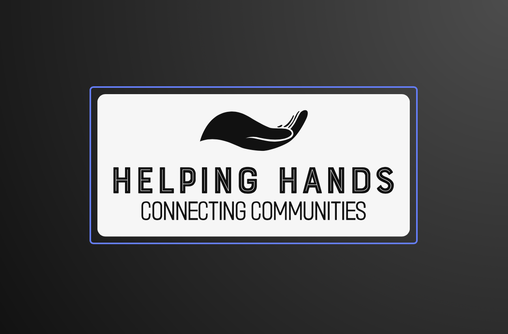

**[Helping Hands]([https://www.figma.com/proto/8sfH7PEiBbzyILFKZRHFqd/Helping-Hands-Prototype?type=design&node-id=179-3647&scaling=scale-down&page-id=0%3A1&starting-point-node-id=179%3A3647])** is connecting helpers with people who need help. Immerse yourself in the world of social work. Join our community, help the people around you and receive help for others. After all, it has to be One Human for Another! 

### What is Helping Hands and Why is it Important to Us? (Task 1 P1)

We have people in our society who need support and care from others. There are also people who want to help these kinds of people. The problem is, there is no effective platform that connects these two groups. We intend to provide such a platform. The problem from our perspective is a problem because there will always be things a single person could not hope to accomplish on their own, and we want to create more opportunities for people to reach out to one another within the community in times of need. People are often forced to exhaust their funds and time in order to solve the problem of finding quality and caring helpers in today's current social and economic climate.

The design of a mutual aid app is important because it can greatly benefit communities in need. The app can help people work together, share resources, and gather information about the community's needs. This can make it easier for people to get help with things like food and healthcare. A good mutual aid app can simplify things by being a one stop shop for all aid efforts. By doing this, it can make it easier for people to access the help they need and reduce any obstacles that may be preventing them from getting it.

### User Research Data and Analysis (Task 2 P2)

### Iterations From Wireframes to Prototypes (Task 3 P3)

### Future Design Potential and What we Learned (Task 2 P4)

### Introducing Our Team! (Task 1 P5)

#### Farhan Haider

#### Sean Locklar

#### Daniel Moorhatch

#### Jeremiah Ruvalcaba

#### Justin Yu
